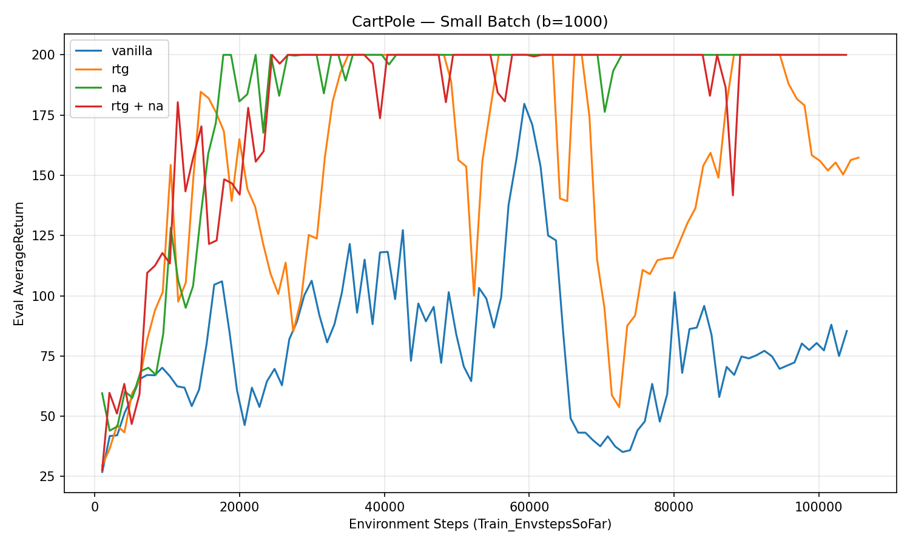
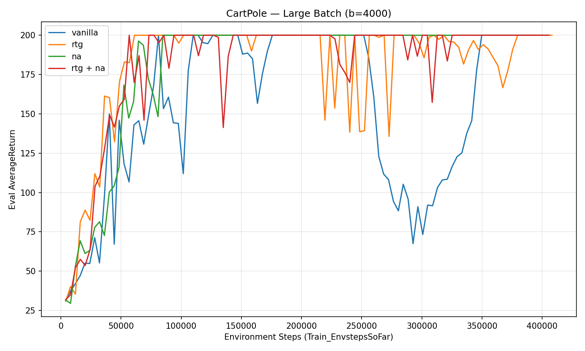
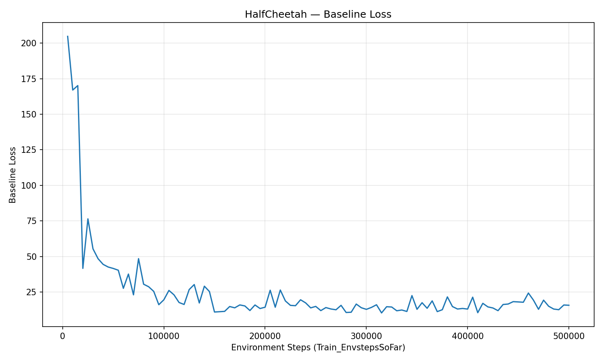
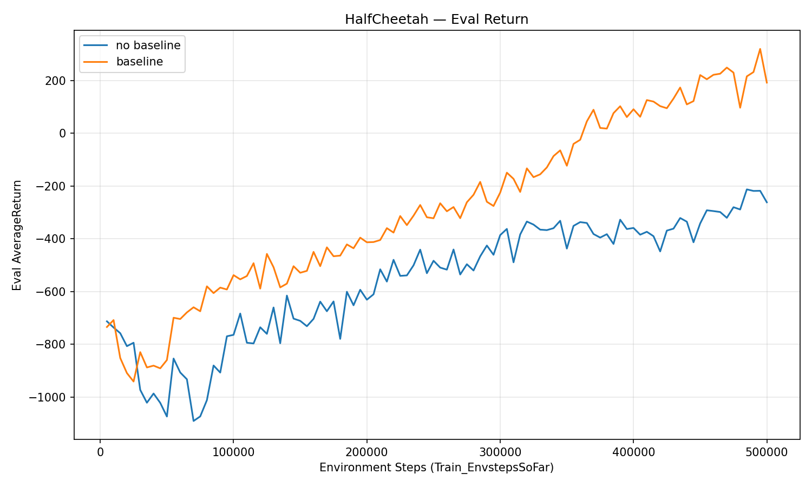
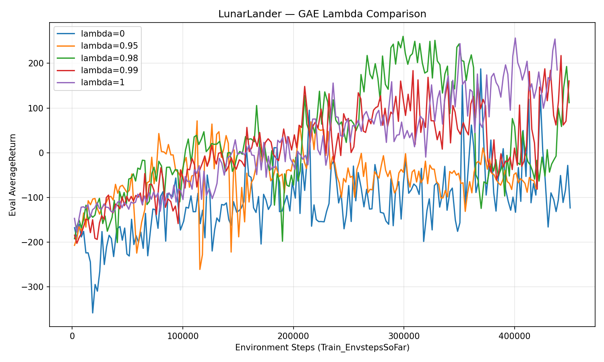
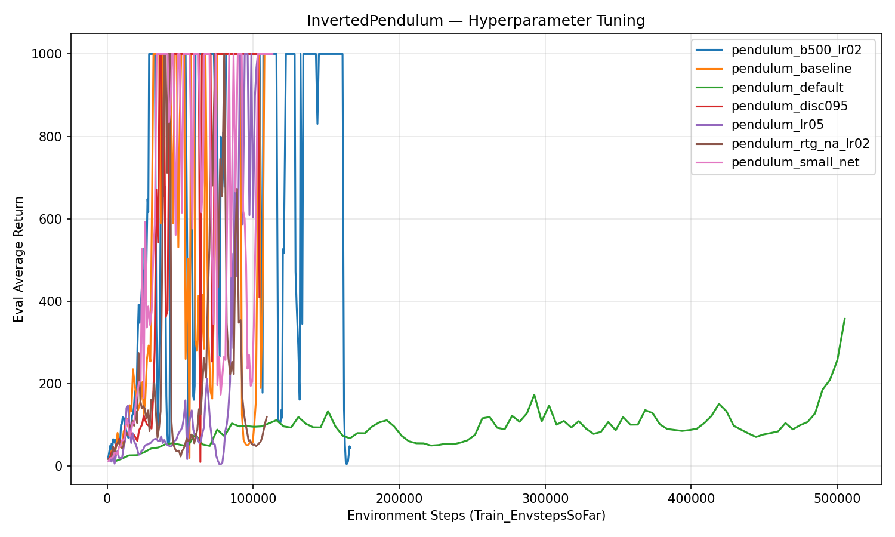

# CS 185/285 HW2: Policy Gradients — Report

---

## Experiment 1: CartPole (Section 3)

### Commands Used

```bash
# Small batch experiments
uv run src/scripts/run.py --env_name CartPole-v0 -n 100 -b 1000 --exp_name cartpole
uv run src/scripts/run.py --env_name CartPole-v0 -n 100 -b 1000 -rtg --exp_name cartpole_rtg
uv run src/scripts/run.py --env_name CartPole-v0 -n 100 -b 1000 -na --exp_name cartpole_na
uv run src/scripts/run.py --env_name CartPole-v0 -n 100 -b 1000 -rtg -na --exp_name cartpole_rtg_na

# Large batch experiments
uv run src/scripts/run.py --env_name CartPole-v0 -n 100 -b 4000 --exp_name cartpole_lb
uv run src/scripts/run.py --env_name CartPole-v0 -n 100 -b 4000 -rtg --exp_name cartpole_lb_rtg
uv run src/scripts/run.py --env_name CartPole-v0 -n 100 -b 4000 -na --exp_name cartpole_lb_na
uv run src/scripts/run.py --env_name CartPole-v0 -n 100 -b 4000 -rtg -na --exp_name cartpole_lb_rtg_na
```

No parameters were changed from defaults beyond those shown above.

### Learning Curves

#### Small Batch (b=1000)



#### Large Batch (b=4000)



### Questions

**Which value estimator has better performance without advantage normalization: the trajectory-centric one, or the one using reward-to-go?**

Reward-to-go performs better in the small batch case (`cartpole_rtg` reaches ~155 avg return vs. `cartpole` at ~85). In the large batch case, both converge to 200, though the vanilla trajectory-centric estimator actually converges slightly faster. Overall, reward-to-go shows a clearer advantage when the batch size is small and variance matters more.

**Between the two value estimators, why do you think one is generally preferred over the other?**

Reward-to-go is generally preferred because it exploits causality: an action at time t cannot affect rewards that already occurred before time t. The trajectory-centric estimator assigns credit for past rewards to the current action, which is pure noise in the gradient estimate. By only summing rewards from time t onward, reward-to-go removes this irrelevant signal and reduces variance.

**Did advantage normalization help?**

Yes, significantly. In the small batch case, advantage normalization was the biggest factor — both `cartpole_na` and `cartpole_rtg_na` converge to 200, while without it, `cartpole` (~85) and `cartpole_rtg` (~155) fail to reach the maximum. Normalization centers the advantages around zero, ensuring some actions are reinforced and others are discouraged within each batch, rather than all being pushed in the same direction.

**Did the batch size make an impact?**

Yes. With a larger batch size (b=4000), all configurations converge to 200, including the vanilla estimator which struggles at b=1000. The learning curves are also smoother with larger batches. This is because larger batches provide a better Monte Carlo estimate of the policy gradient, reducing the variance of the gradient updates.

---

## Experiment 2: HalfCheetah (Section 4)

### Commands Used

```bash
# No baseline
uv run src/scripts/run.py --env_name HalfCheetah-v4 -n 100 -b 5000 -eb 3000 -rtg \
    --discount 0.95 -lr 0.01 --exp_name cheetah

# Baseline
uv run src/scripts/run.py --env_name HalfCheetah-v4 -n 100 -b 5000 -eb 3000 -rtg \
    --discount 0.95 -lr 0.01 --use_baseline -blr 0.01 -bgs 5 --exp_name cheetah_baseline
```

No parameters were changed from defaults beyond those shown above.

### Learning Curves

#### Baseline Loss



#### Eval Return



### Reduced Baseline Gradient Steps / Learning Rate Experiment

```bash
# TODO: Add your command here (e.g., with -bgs 1 or -blr 0.001)
```

**How does reducing baseline gradient steps (or baseline learning rate) affect:**

**(a) The baseline learning curve?**

> TODO: Answer here.

**(b) The performance of the policy?**

> TODO: Answer here.

---

## Experiment 3: LunarLander (Section 5)

### Commands Used

```bash
uv run src/scripts/run.py --env_name LunarLander-v2 --ep_len 1000 --discount 0.99 \
    -n 200 -b 2000 -eb 2000 -l 3 -s 128 -lr 0.001 --use_reward_to_go --use_baseline \
    --gae_lambda 0 --exp_name lunar_lander_lambda0

uv run src/scripts/run.py --env_name LunarLander-v2 --ep_len 1000 --discount 0.99 \
    -n 200 -b 2000 -eb 2000 -l 3 -s 128 -lr 0.001 --use_reward_to_go --use_baseline \
    --gae_lambda 0.95 --exp_name lunar_lander_lambda0.95

uv run src/scripts/run.py --env_name LunarLander-v2 --ep_len 1000 --discount 0.99 \
    -n 200 -b 2000 -eb 2000 -l 3 -s 128 -lr 0.001 --use_reward_to_go --use_baseline \
    --gae_lambda 0.98 --exp_name lunar_lander_lambda0.98

uv run src/scripts/run.py --env_name LunarLander-v2 --ep_len 1000 --discount 0.99 \
    -n 200 -b 2000 -eb 2000 -l 3 -s 128 -lr 0.001 --use_reward_to_go --use_baseline \
    --gae_lambda 0.99 --exp_name lunar_lander_lambda0.99

uv run src/scripts/run.py --env_name LunarLander-v2 --ep_len 1000 --discount 0.99 \
    -n 200 -b 2000 -eb 2000 -l 3 -s 128 -lr 0.001 --use_reward_to_go --use_baseline \
    --gae_lambda 1 --exp_name lunar_lander_lambda1
```

No parameters were changed from defaults beyond those shown above.

### Learning Curves



### Questions

**How did lambda affect task performance?**

> TODO: Describe the trend you observe across different lambda values.

**What does lambda=0 correspond to? What about lambda=1?**

> TODO: lambda=0 corresponds to... lambda=1 corresponds to... Relate to the LunarLander results.

---

## Experiment 4: InvertedPendulum (Section 6)

### Commands Used

```bash
# Default
uv run src/scripts/run.py --env_name InvertedPendulum-v4 -n 100 -b 5000 -eb 1000 \
    --exp_name pendulum

# Best hyperparameters
# TODO: Add your tuned command here
```

### Best Hyperparameters

> TODO: List the hyperparameters you changed and briefly discuss which ones mattered most in your tuning process.

### Learning Curves



> TODO: Show your tuned run reaching return of 1000 within 100K environment steps, compared to the default setting.