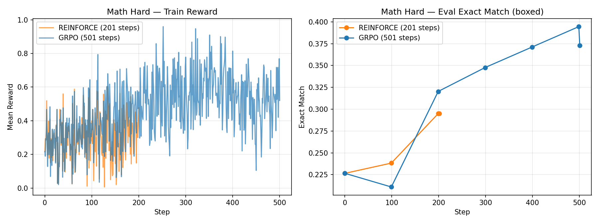
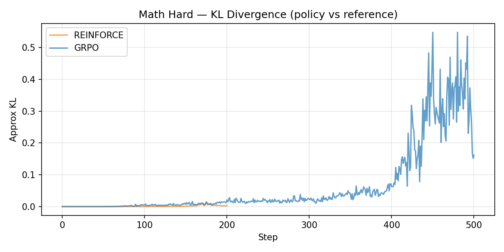
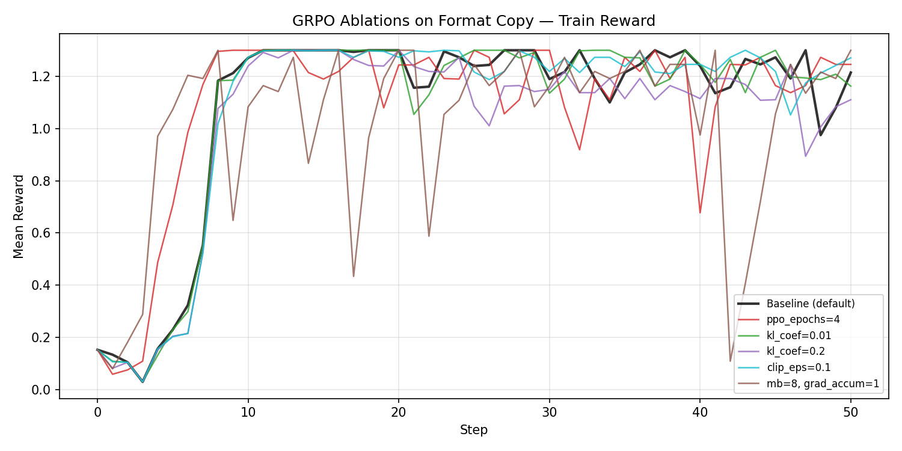
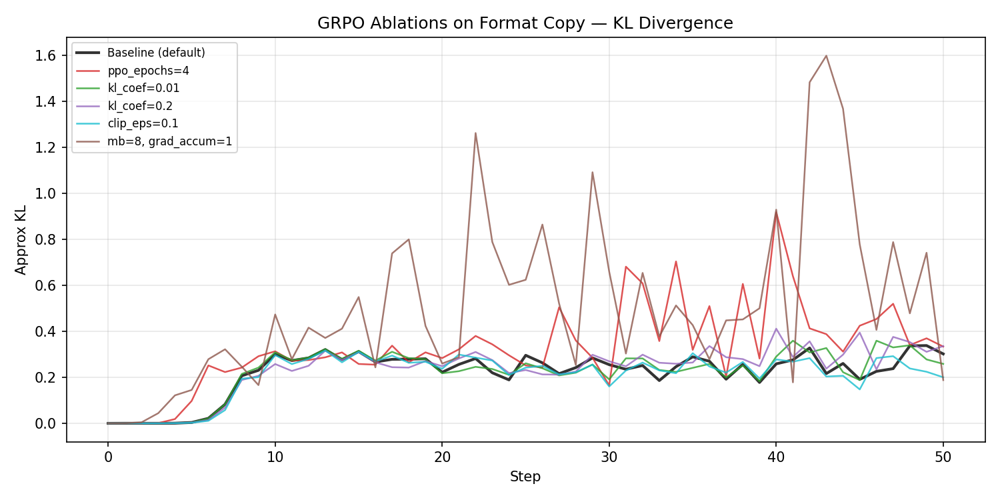
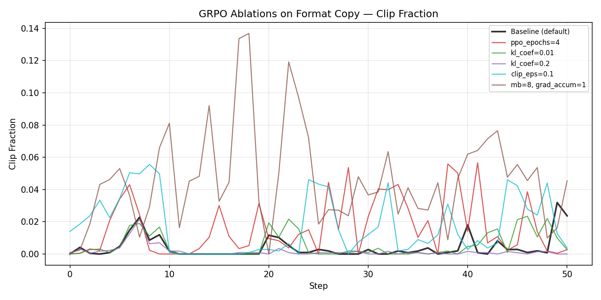
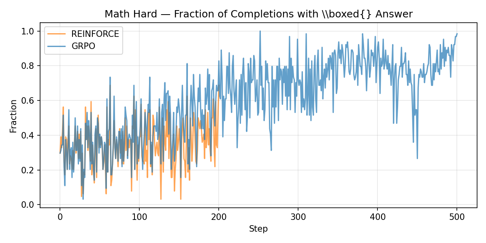
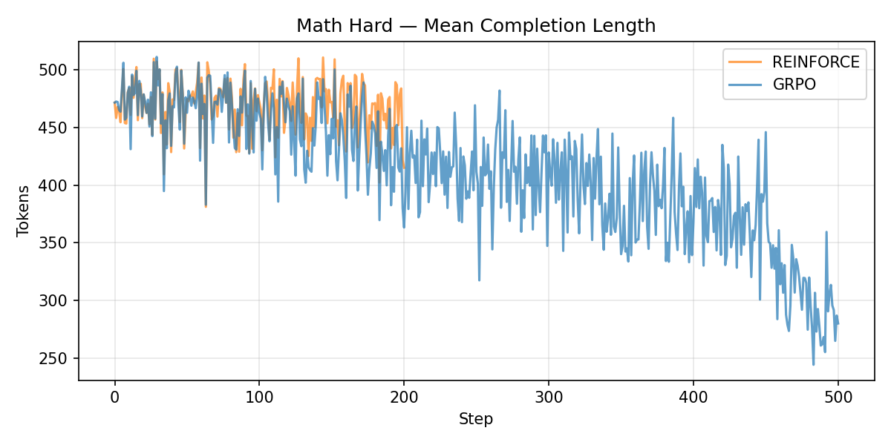

# HW4: LLM Reinforcement Learning — Report

## Question 1: Approximate KL

The estimator `e^Δ − Δ − 1` (where `Δ = log(π_ref / π_new)`) is a valid sampled-token KL estimator because when we take its expectation under `π_new`, we recover the exact KL divergence `KL(π_new || π_ref)`. This follows from:

```
E_{x ~ π_new}[e^Δ − Δ − 1] = E_{x ~ π_new}[π_ref(x)/π_new(x) − log(π_ref(x)/π_new(x)) − 1]
```

The first term equals 1 (since `Σ π_new(x) · π_ref(x)/π_new(x) = Σ π_ref(x) = 1`), and the remaining terms simplify to `E[-log(π_ref/π_new)] = KL(π_new || π_ref)`. The estimator is always non-negative (`e^x − x − 1 ≥ 0` for all x, by convexity of exp), which matches the non-negativity of KL divergence and provides numerical stability.

Computing the **exact full-vocabulary KL** at every token position would require materializing the full softmax distribution over the entire vocabulary (~151K tokens for Qwen2.5) for **both** the policy and reference model at every token position. For a batch of 64 sequences of length 512, this means two `[64, 512, 151K]` tensors — roughly 40 GB just for logits. The approximate estimator only needs the log-probability of the **actually sampled token** from each model (one scalar per position), making it orders of magnitude cheaper in both compute and memory.

## Question 2: Implementation

I implemented the TODOs in order (1 through 8):

1. `compute_per_token_logprobs` — forward pass, shift logits by 1, `F.cross_entropy`, negate
2. `build_completion_mask` — [B, L-1] mask starting at `prompt_input_len - 1`
3. `approx_kl_from_logprobs` — clamped delta, `exp(delta) - delta - 1`, masked_mean
4. `iter_minibatches` — shuffle indices, slice all RolloutBatch fields consistently
5. `compute_group_advantages` — reshape rewards to [num_groups, group_size], z-score within groups
6. `maybe_normalize_advantages` — global z-score if enabled
7. `Reinforce.update` — new_logp, masked_mean_per_row for seq_logp, pg_loss, kl, entropy
8. `GRPO.update` — importance ratio with clamped log-ratio, PPO clip objective, clipfrac

**Bug/confusion resolved:** In TODO 2 (`build_completion_mask`), I initially created a mask of shape `[B, L]` instead of `[B, L-1]`, and used offset `prompt_input_len` instead of `prompt_input_len - 1`. The key insight is that logprobs are shifted by 1 relative to input_ids — logprob at index `t` scores `input_ids[t+1]` — so the completion mask must also be `[B, L-1]` and the completion region starts one position earlier than the raw prompt length.

## Question 3: GR-REINFORCE vs. GRPO on Math Hard





### Results

| Metric | REINFORCE (201 steps) | GRPO (501 steps) |
|--------|----------------------|------------------|
| Baseline eval exact match | 0.227 | 0.227 |
| Eval at step 100 | 0.238 | 0.211 |
| Eval at step 200 | 0.295 | 0.320 |
| Final eval exact match | 0.295 (step 201) | 0.373 (step 501) |
| Final train reward | 0.477 | 0.520 |

### Analysis

Over the first 200 iterations, both methods start from the same baseline (0.227 eval exact match). REINFORCE reaches 0.295 by step 200 with steady but slow improvement. GRPO starts slower (0.211 at step 100) but accelerates and reaches 0.320 by step 200 — already surpassing REINFORCE.

This comparison is interesting because both methods see the **same number of unique prompts** over the first 200 steps (same `batch_size=8, group_size=8`). The key difference is that GRPO reuses each rollout batch for `ppo_epochs=2` optimization passes with clipped importance ratios, while REINFORCE does a single on-policy update and discards the data. GRPO extracts more gradient signal per rollout, and the PPO clipping mechanism prevents the off-policy updates from diverging.

GRPO's advantage becomes more pronounced over its remaining 300 steps, reaching 0.373 — a 28% relative improvement over REINFORCE's final 0.295. The rollout reward curves fluctuate significantly step-to-step (as expected — different prompts have different difficulty), but the eval curves are smoother and clearly show GRPO's advantage.

## Question 4: GRPO Ablations on Format Copy

### Baseline Configuration
Default format_copy + GRPO: `ppo_epochs=2, kl_coef=0.05, clip_eps=0.2, minibatch_size=48, grad_accum_steps=1`







### Results

| Run | Changed Param | Final Reward (step 50) | Final Eval | Final KL | Stability Notes |
|-----|--------------|----------------------|------------|----------|-----------------|
| **Baseline** | — | 1.215 | 1.00 | 0.302 | Stable throughout |
| **ppo_epochs=4** | ppo_epochs: 2→4 | 1.246 | 1.00 | 0.334 | KL spikes to 0.92 at step 40 |
| **kl_coef=0.01** | kl_coef: 0.05→0.01 | 1.163 | 1.00 | 0.259 | Moderate fluctuation |
| **kl_coef=0.2** | kl_coef: 0.05→0.2 | 1.110 | 1.00 | 0.336 | Reward degrades in later steps (drops to ~0.89) |
| **clip_eps=0.1** | clip_eps: 0.2→0.1 | 1.271 | 1.00 | 0.201 | Most stable, lowest KL |
| **grad_accum=1, mb=8** | minibatch_size: 48→8 | 1.300 | 1.00 | 0.188 | Very unstable, KL spikes to 1.6, reward crashes to 0.1 |

### Analysis

**Which hyperparameters mattered most:**

1. **minibatch_size / grad_accum_steps** had the largest effect on stability. With `minibatch_size=8, grad_accum_steps=1`, each rollout produces `ppo_epochs × (48/8) = 12` optimizer updates instead of 2. This caused massive KL divergence spikes (up to 1.6) and reward collapses — at step 42, reward crashed to 0.1 before recovering by step 46. The policy takes too many gradient steps on each batch, causing it to overshoot and oscillate. The clip fraction plot confirms this: `mb=8` has the highest clip fraction (~0.13), indicating the policy ratio frequently exceeded the trust region. This is the clearest example of instability from excessive per-rollout updates.

2. **kl_coef** controlled the reward-KL tradeoff. With `kl_coef=0.01` (weaker penalty), the policy was less constrained and learned similarly to baseline. With `kl_coef=0.2` (stronger penalty), rewards degraded noticeably in the second half of training — dropping from ~1.30 to ~0.89–1.11 — because the KL penalty dominated the objective and prevented the policy from fully exploiting the learned behavior. The sweet spot was the baseline value of 0.05.

3. **clip_eps=0.1** (tighter clipping) was the most stable configuration, with the lowest KL throughout (0.20 vs 0.30 baseline) and consistently high rewards. Tighter clipping prevents large policy updates, keeping training smooth. This was **competitive with or slightly better than the baseline** for this task.

4. **ppo_epochs=4** worked but showed increasing instability toward the end. KL spiked to 0.92 at step 40 (vs 0.30 baseline), indicating the policy drifted significantly from the rollout data. The clip mechanism contained the damage but couldn't fully prevent drift.

**Settings that made learning worse:**
- `kl_coef=0.2`: Too much regularization — the KL penalty overwhelmed the reward signal, causing reward to plateau/degrade.
- `grad_accum=1, mb=8`: Too many optimizer updates per rollout — classic PPO instability from taking too many steps on stale data.

**Best alternative configuration:** `clip_eps=0.1` matched baseline performance with better stability (lower KL variance).

## Question 5: Qualitative Behavior (Math Hard)

### Observation 1: Format learning precedes reasoning improvement



The `boxed_answer_pattern` fraction increased steadily throughout GRPO training, rising from ~0.30 early on to ~0.85 by step 500. Meanwhile, the eval exact match only improved from 0.227 to 0.373. This gap shows the model first learned to **format** its answers in `\boxed{}` — satisfying the reward parser's structural expectation — before improving the actual mathematical correctness of those answers. The model learned to "play the game" of formatting before solving harder problems.

### Observation 2: Completion length decreases with training



Mean completion length dropped from ~470 tokens early in training to ~280 tokens by step 500 under GRPO. Early completions frequently rambled to the 512-token limit without reaching an answer. After training, the model learned to produce more concise reasoning chains and terminate with a boxed answer. This is a qualitative shift: rather than just improving accuracy on the same length of output, the model learned to be more efficient in its reasoning, which correlates with higher reward since completions that terminate properly are more likely to contain a parseable answer.

REINFORCE shows a similar but weaker trend over its 201 steps — completion length decreases from ~470 to ~430 tokens — consistent with its slower overall learning.

---

## Generating plots

```bash
uv pip install matplotlib
uv run python scripts/plot_results.py
```

All plots are saved in `hw4/plots/`.

## Submission Checklist

- [x] 4 required training runs completed
  - [x] format_copy + GRPO (eval: 1.00)
  - [x] format_copy + REINFORCE (eval: 1.00)
  - [x] math_hard + REINFORCE (eval: 0.295)
  - [x] math_hard + GRPO (eval: 0.373)
- [x] 5 GRPO ablation runs on format_copy completed
  - [x] ppo_epochs=4
  - [x] kl_coef=0.01
  - [x] kl_coef=0.2
  - [x] clip_eps=0.1
  - [x] grad_accum_steps=1, minibatch_size=8
- [x] Report questions 1-5 answered with data and plots
- [x] Plots generated via `scripts/plot_results.py`
- [ ] Convert report.md to PDF for submission
- [ ] Gradescope submission bundle built
- [ ] Code + artifacts zipped and uploaded to autograder
- [ ] Report PDF uploaded to report assignment
